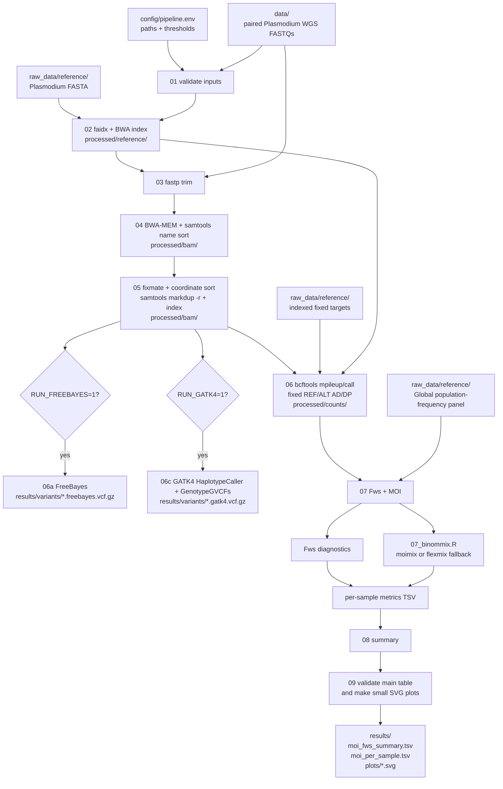

# Plasmodium WGS MOI/Fws pipeline

This repository contains a small, sequential pipeline for paired-end
*Plasmodium* WGS data. It trims reads, maps them to a parasite reference,
removes PCR duplicates, counts alleles at a frozen target panel, and reports
Fws plus a BinomMix MOI estimate for every sample. The final step validates the
human-readable main table and writes three small SVG quality/result plots.
The always-on BCFtools branch extracts the frozen-panel REF/ALT counts used by
MOI/Fws. Optional FreeBayes and GATK4 branches can also call ordinary variants
from each deduplicated BAM and write indexed VCFs; both are disabled by default.

## Applicability to Plasmodium WGS

Yes, for fixed-panel MOI/Fws analysis of short-read paired-end data, provided
that the reference FASTA, target file, and population-frequency panel describe
the same organism, contig names, and REF/ALT alleles. This workflow uses a
*P. falciparum* Pf3D7/Pf4 panel; that panel must not be reused
for another Plasmodium species or a different allele universe.

The fixed-site path intentionally stops at allele counts, which is the input
required by the MOI/Fws calculation. FreeBayes and GATK4 are available as
optional whole-genome variant-calling conveniences, but their VCFs still require
project-specific filtering and review before scientific interpretation. No
FASTQ, BAM, reference, index, or result file is stored in this repository.

## Quick start

Run these commands from this repository root:

```bash
./setup.sh --help
./setup.sh
conda activate moi_pipeline
# edit config/pipeline.env if reference/target paths differ
./run_pipeline.sh build-metadata
# inspect/correct data/metadata.txt, then:
./run_pipeline.sh
```

The configuration is [`config/pipeline.env`](config/pipeline.env).

Create `data/` and copy all paired FASTQ/FASTQ.GZ files there before the first
metadata build. The pipeline creates `data/samples.tsv` and `data/merged/`
when multiple lanes need to be combined; `processed/` and `results/` are
created as needed.

After a completed run, the table check and plot generation can also be repeated
without rerunning previous steps:

```bash
./scripts/09_check_main_table_and_plots.py config/pipeline.env
```

`setup.sh` creates or updates the Conda environment `moi_pipeline`. The default
configuration uses separate data, intermediate, and result directories (the
biological files themselves are deliberately not included):

The setup and pipeline invoke tools from the active Conda environment
explicitly. This avoids accidentally mixing Homebrew/system programs when
their executables appear before Conda on `PATH` (a common macOS configuration).
The environment contains a complete R 4.3 base installation (including the
`R` and `Rscript` executables, `flexmix`, `remotes`, and `BiocManager`) and
Python 3.11 with `pip`, `setuptools`, and `wheel`. The wrapper prepends the
active environment before launching Python/R steps.

Every pipeline step reads `MAX_RAM_GB` (default `48`) and rejects values above
48 GiB. GATK's `-Xmx` is checked against the same ceiling, R receives a
matching `R_MAX_VSIZE`, and common BLAS runtimes inherit the configured thread
count. On Linux a per-process virtual-memory limit is also applied; macOS does
not offer a portable hard RSS limit, so the explicit Java/R limits and
sequential execution are the portable safeguards there. This is a ceiling,
not a request to allocate 48 GiB for every tool.

```text
data/
├── *.fastq.gz                               # input paired-end reads
├── metadata.txt                             # generated/reviewed file/lane/sample/read map
├── samples.tsv                              # generated canonical sample sheet
└── merged/                                   # generated multi-lane FASTQs
raw_data/
└── reference/                               # external reference resources
    ├── GCF_000002765.6_genomic.fna          # Pf3D7 FASTA
    ├── pf4_global_maf001.targets.tsv.gz     # indexed target panel
    └── pf4_population_panel.tsv.gz          # target-aligned frequencies
processed/                                   # created at runtime: intermediates/QC/logs
results/                                     # created at runtime: final tables/plots
```

Put the FASTQs in `data/` for the root metadata workflow and the reference
resources in `raw_data/reference/`. The reference, target, panel, and runtime
paths can be changed in `config/pipeline.env`; `processed/` contains
reusable intermediate artefacts and logs; `results/` contains the compact final
tables and plots. Both are ignored by Git. `setup.sh` does not download
biological data. If Conda, the solver,
an environment directory, an executable, or an R package is unavailable, it
prints the cause and a concrete fix. `setup.sh` cannot activate an environment
in the parent shell; run `conda activate moi_pipeline` afterwards.

## Metadata build and lane handling

The first command scans `data/` and writes a reviewable, tab-separated
`data/metadata.txt`:

```bash
./run_pipeline.sh build-metadata
```

Supported Illumina-style names include `sample_S1_L001_R1_001.fastq.gz`,
`sample_L002_R2.fastq.gz`, `sample_R1.fastq.gz`, and `sample.2.fq.gz`.
Illumina index-read files ending in `I1` or `I2` are ignored automatically.
The generated manifest has one row per FASTQ:

```text
file	lane	sample	read
sample_S1_L001_R1_001.fastq.gz	L001	sample	R1
sample_S1_L001_R2_001.fastq.gz	L001	sample	R2
sample_S1_L002_R1_001.fastq.gz	L002	sample	R1
sample_S1_L002_R2_001.fastq.gz	L002	sample	R2
```

The command then stops and asks you to inspect the file. Correct any sample,
lane, read, or file-path assignment manually. Every sample/lane must have both
R1 and R2; missing mates or unrecognized names are reported as errors. On the
next `./run_pipeline.sh` call, reviewed metadata is validated, FASTQs from
multiple lanes are merged into `data/merged/`, and the canonical
`data/samples.tsv` is generated for the existing pipeline.
The root runner records a metadata checksum and automatically forces
`RESUME=0` when the reviewed assignment changes, preventing stale trimmed/BAM
outputs from being reused after a correction.

Sample IDs may contain letters, numbers, `.`, `_`, and `-`; absolute file paths
are accepted in a manually edited metadata file.

## Configuration

All user-editable parameters are in [`config/pipeline.env`](config/pipeline.env).
Paths may be absolute or relative to the repository root.

The shipped defaults are conservative values for paired-end Illumina WGS and
the Pf3D7/Pf4 fixed-site analysis. They do not assume a particular cluster
scheduler, hidden filesystem mount, or pre-existing output directory.

| parameter | meaning |
|---|---|
| `SAMPLES_TSV` | generated three-column paired-read sheet (`sample_id`, `R1`, `R2`); default `data/samples.tsv` |
| `RAW_DIR` | base directory for relative FASTQ paths; default `data` |
| `REFERENCE` | parasite reference FASTA; default `raw_data/reference/GCF_000002765.6_genomic.fna` for official *P. falciparum* 3D7 assembly `GCF_000002765.6`; indexes are created under `PROCESSED_DIR/reference` |
| `TARGETS` | indexed frozen target file; default `raw_data/reference/pf4_global_maf001.targets.tsv.gz`; supports four columns `chrom,pos,ref,alt` or three columns `chrom,pos,REF,ALT` where REF and ALT are comma-separated |
| `POPULATION_PANEL` | target-aligned frequency table with `chrom`, `pos`, `ref`, `alt`, and `Global`; default `raw_data/reference/pf4_population_panel.tsv.gz` |
| `PROCESSED_DIR` | intermediate files, temporary files, QC reports, and logs; default `processed` |
| `OUTPUT_DIR` | final metrics and summary tables; default `results` |
| `PLOTS_DIR` | directory for the small SVG plots; relative paths are below `OUTPUT_DIR`; default `plots` |
| `THREADS` | threads for trimming, mapping, and BAM processing; default `8` |
| `TRIM_QUALITY` | minimum base quality used by `fastp`; default `30` |
| `MIN_READ_LENGTH` | discard reads shorter than this after trimming; default `75` |
| `ADAPTER_R1`, `ADAPTER_R2` | optional explicit adapter sequences; default empty (fastp auto-detection) |
| `MIN_MAPQ` | mapping-quality filter used by `bcftools mpileup`; default `30` |
| `MIN_BASEQ` | base-quality filter used by `bcftools mpileup`; default `20` |
| `MAX_DEPTH` | per-file depth cap for `bcftools mpileup`; default `100000` |
| `RUN_FREEBAYES` | `1` enables optional FreeBayes VCF calling after duplicate removal; default `0` |
| `FREEBAYES_PLOIDY` | FreeBayes ploidy passed to each BAM; default `1` |
| `FREEBAYES_MIN_ALT_COUNT` | minimum alternate observations for a FreeBayes call; default `2` |
| `FREEBAYES_MIN_ALT_FRACTION` | minimum alternate fraction for a FreeBayes call; default `0.2` |
| `RUN_GATK4` | `1` enables optional GATK4 HaplotypeCaller/GenotypeGVCFs VCF calling after duplicate removal; default `0` |
| `GATK_PLOIDY` | sample ploidy passed to HaplotypeCaller and GenotypeGVCFs; default `2` |
| `GATK_HETEROZYGOSITY` | HaplotypeCaller heterozygosity prior; default `0.0029` |
| `GATK_INDEL_HETEROZYGOSITY` | HaplotypeCaller indel heterozygosity prior; default `0.0017` |
| `GATK_MIN_ASSEMBLY_REGION_SIZE` | minimum HaplotypeCaller assembly region; default `100` |
| `GATK_MIN_BASE_QUALITY_SCORE` | minimum base quality accepted by HaplotypeCaller; default `5` |
| `GATK_BASE_QUALITY_SCORE_THRESHOLD` | base-quality threshold used by HaplotypeCaller; default `12` |
| `GATK_STAND_CALL_CONF` | GenotypeGVCFs stand-call confidence threshold; default `30` |
| `GATK_JAVA_OPTIONS` | Java options for GATK commands; default `-Xmx4g` |
| `GATK_DISABLE_MAPPING_QUALITY_FILTER` | `1` disables HaplotypeCaller’s mapping-quality read filter (the paper setting); default `1` |
| `POPULATION` | population column used for Fws; it must exist in `POPULATION_PANEL`; default `Global` |
| `FWS_MIN_DEPTH` | minimum modelled allele depth for Fws; default `50` |
| `MAX_UNMODELLED_FRACTION` | maximum fraction of reported depth not represented in REF/ALT; default `0.02` |
| `K_VALUES` | candidate MOI components; default `1,2,3,4,5` |
| `MOI_COVERAGE_THRESHOLD` | minimum depth for BinomMix sites; default `10` |
| `MOI_NITER` | maximum mixture-model iterations; default `1000` |
| `RESUME` | `1` reuses non-empty completed outputs; `0` recomputes them; default `1` |

## Ordered scripts

The root [`run_pipeline.sh`](run_pipeline.sh) handles the metadata-build pause,
converts the reviewed manifest into the canonical sample sheet, and then
delegates to the numbered scripts below. The numbered runner can still be
called directly when an already prepared `SAMPLES_TSV` is supplied.

| step | script | program/action | important output |
|---:|---|---|---|
| 1 | `scripts/01_validate_inputs.sh` | checks Conda tools, sample sheet, FASTQs, reference, target index, panel, and `moimix`/`flexmix` | fail-fast preflight |
| 2 | `scripts/02_prepare_reference.sh` | creates an intermediate-local FASTA symlink, `samtools faidx`, `bwa index`, and (when enabled) the GATK sequence dictionary | `processed/reference/reference.fasta.fai`, BWA index, and optional `reference.dict` |
| 3 | `scripts/03_trim_reads.sh` | `fastp` paired-end adapter detection, quality filtering, and minimum length | `processed/trimmed/<sample>_R1/R2.fastq.gz` plus JSON/HTML QC |
| 4 | `scripts/04_align_wgs.sh` | `bwa mem` with a read group, piped to `samtools sort -n` | `processed/bam/<sample>.name.bam` |
| 5 | `scripts/05_mark_duplicates.sh` | `samtools fixmate`, coordinate sort, `samtools markdup -r`, and index | `processed/bam/<sample>.dedup.bam` + BAI; `processed/qc/duplicates/` flagstat |
| 6a (optional) | `scripts/06_call_variants_freebayes.sh` | FreeBayes calling from each deduplicated BAM, BGZF compression, and Tabix indexing | `results/variants/<sample>.freebayes.vcf.gz` + `.tbi` |
| 6c (optional) | `scripts/06_call_variants_gatk4.sh` | GATK4 HaplotypeCaller gVCF, then GenotypeGVCFs and Tabix indexing | `results/variants/<sample>.gatk4.vcf.gz` + `.tbi`; intermediate `processed/gatk4/<sample>.g.vcf.gz` |
| 6 | `scripts/06_extract_counts.sh` | `bcftools mpileup` (`MAPQ`, `baseQ`, depth limits) plus haploid allele-constrained `bcftools call` | `processed/counts/<sample>.tsv` with `chrom/pos/ref/alt/AD/DP` |
| 7 | `scripts/07_estimate_moi_fws.py` + `scripts/07_binommix.R` | Fws from the population panel, then BinomMix over `K_VALUES` | `results/metrics/<sample>.moi_fws.tsv`; R logs in `processed/logs/` |
| 8 | `scripts/08_summary.sh` | combines all rows and selects one human-readable line per sample | `results/moi_fws_summary.tsv` and `results/moi_per_sample.tsv` |
| 9 | `scripts/09_check_main_table_and_plots.py` | validates table headers, sample uniqueness, MOI/BIC fields, Fws values, and metric completeness; writes small dependency-free SVG plots | `OUTPUT_DIR/plots/moi_per_sample.svg`, `OUTPUT_DIR/plots/fws_per_sample.svg`, and `OUTPUT_DIR/plots/bic_support_per_sample.svg` |

The top-level `scripts/00_run_pipeline.sh` calls those steps sequentially;
the optional 6a and 6c branches exit cleanly when their `RUN_*` setting is `0`.
Full command output is written to `PROCESSED_DIR/logs`; the terminal shows only step,
sample, and completion status. A failed command prints its last 40 log lines
and an explicit repair suggestion.

### Optional FreeBayes VCF calling

Set `RUN_FREEBAYES=1` in the configuration and run the normal pipeline. After
duplicate removal, one compressed and Tabix-indexed VCF is written per sample:

```text
results/variants/<sample>.freebayes.vcf.gz
results/variants/<sample>.freebayes.vcf.gz.tbi
```

The branch uses the configured `MIN_MAPQ` and `MIN_BASEQ` values and the
`FREEBAYES_*` thresholds. It calls across the reference (not only the frozen
MOI target panel); use a separate, validated filtering/annotation workflow for
downstream variant analyses. The fixed-target counts and MOI/Fws outputs are
unchanged by enabling this branch.

### Optional GATK4 VCF calling

Set `RUN_GATK4=1` and run the normal pipeline. Step 02 creates the FASTA
sequence dictionary required by GATK4. For each deduplicated BAM, step 6c runs
`HaplotypeCaller -ERC GVCF`, indexes the sample gVCF, and genotypes it with
`GenotypeGVCFs`:

```text
processed/gatk4/<sample>.g.vcf.gz
processed/gatk4/<sample>.g.vcf.gz.tbi
results/variants/<sample>.gatk4.vcf.gz
results/variants/<sample>.gatk4.vcf.gz.tbi
```

The default priors and thresholds (`0.0029` heterozygosity, `0.0017` indel
heterozygosity, minimum assembly region `100`, minimum base quality `5`, base
quality threshold `12`, mapping-quality filter disabled, and stand-call
confidence `30`) follow the optimized *P. falciparum* WGS settings reported in
the linked GATK4 study. This implementation applies those settings to the
existing Pf-only deduplicated BAMs. It does not yet reproduce the paper’s
competitive human+Pf mapping, joint multi-sample GenomicsDB import, VQSR
training/filtering, or annotation steps; validate and filter the VCFs for the
intended project before interpretation. The default ploidy is `2`; set
`GATK_PLOIDY=6` explicitly when you want the paper’s higher-ploidy
low-abundance-variant mode.

## MOI, Fws, and confidence fields

The exact MOI point is step 7. `07_estimate_moi_fws.py` calculates the two Fws
diagnostics, then calls `07_binommix.R`, which calls
`moimix::binommix(..., k=K_VALUES, niter=MOI_NITER)` when available. If `moimix`
cannot be built but `flexmix` is available, the script records the explicit
`moimix_unavailable_flexmix_equivalent` reason.

The per-sample table has one `binommix_moi` row with:

- `value`/`model_k`: selected MOI component count;
- `bic`: BIC of the selected model;
- `bic_delta`: difference between the best and second-best finite BIC (blank
  when only one candidate `K` was tested);
- `bic_weight`: relative BIC support among the tested models;
- `confidence`: `high` (weight ≥ 0.90), `moderate` (≥ 0.60), or `low`;
- `pi_hat` and `mu_hat`: fitted mixture proportions and allele-frequency means.

`bic_weight` and the resulting label are model-selection support, not a
calibrated confidence interval. The `moimix` interface used here does not
return a formal per-sample MOI confidence interval. The same table also has
`fws_moimix_compatible` and `fws_direct` rows.

The easy-to-read output is:

```text
results/moi_per_sample.tsv
sample_id  moi  moi_status  bic  bic_delta  bic_weight  confidence  fws
```

Step 9 checks this main table before creating the plots. It requires exactly one
row per sample, the three expected metric rows in the long table, safe and
unique sample IDs, integer MOI values of at least 1 when a model is estimated,
finite BIC values, BIC weights in `[0,1]`, and a confidence label consistent
with the BIC weight. A model-failure row is retained as an explicit
`abstain_model_failure` row rather than being silently dropped. Fws values are
required to be finite when present (values outside the usual `[0,1]` range are
reported as warnings). The check fails with a repair hint if the table is
missing, malformed, duplicated, or inconsistent with the long table.

The same step writes three small, text-based SVGs under `OUTPUT_DIR/plots` (or
the configured `PLOTS_DIR`): MOI per sample, Fws per sample, and relative
BinomMix BIC support per sample. They require no plotting package and are
intended for a quick terminal/browser check, not publication-quality figures.

The generated output layout is therefore:

```text
processed/
├── reference/                # symlink and FASTA/BWA indexes
├── trimmed/                  # fastp reads
├── bam/                      # name-sorted and duplicate-removed BAMs
├── gatk4/                    # optional GATK4 sample gVCFs and indexes
├── counts/                   # fixed-target allele counts
├── qc/                       # fastp and samtools QC reports
└── logs/                     # full command logs
results/
├── variants/                 # optional FreeBayes/GATK4 VCFs and Tabix indexes
├── metrics/                  # per-sample MOI/Fws TSVs
├── moi_fws_summary.tsv       # all three metric rows per sample
├── moi_per_sample.tsv        # one human-readable row per sample
└── plots/                    # three small SVGs from step 09
```

### QC and download checklist

Step 03 writes a fastp JSON and HTML report for each sample under
`processed/qc/trim/`. Step 05 writes duplicate-removed BAM `samtools flagstat`
reports under `processed/qc/duplicates/`. When enabled, FreeBayes and GATK4
each write one VCF and index per sample under
`results/variants/` and logs under `processed/logs/06_freebayes_<sample>.log` or
`processed/logs/06_gatk4_<sample>.log`.
The data-producing commands in steps 02–07 write full logs under
`processed/logs/`; preflight and table checks print
concise diagnostics. The terminal deliberately shows only the current step,
sample, and completion status. Step 09 checks table structure and values before
writing the three small SVGs in `results/plots/`. Review these reports before
interpreting MOI or Fws; this repository does not perform automatic contamination
or coverage-based sample exclusion.

### Real WGS smoke-test data

One small, public paired-end WGS run from the Nature study linked above is
provided under `test_data/nature_tactcv/` (the FASTQs are kept outside Git).
Its metadata and a ready-to-use configuration are included; the directory
README records the accession, checksums, and download commands. The config
also enables both FreeBayes and GATK4. The biological reference and the
matching Pf4 target/population files remain external prerequisites, so the
smoke test must not be interpreted until those resources are supplied.

No biological data are downloaded by `setup.sh`. Download or obtain the FASTQs,
Pf3D7 FASTA, indexed target file, and matching population panel separately;
place FASTQs under `data/` and the reference resources under
`raw_data/reference/` (or set absolute paths in the config). The [resource
section](#references-and-resources) gives the public Pf3D7 accession and a
reproducible NCBI command; the Pf4 target/panel pair must come from the
versioned project release. Keep large files outside Git.

## References and resources

The following table records the biological resources required by this workflow.
None of these files is copied into this repository.

| resource | role in this pipeline | public accession or required filename | required at runtime? |
|---|---|---|---|
| paired WGS FASTQs | raw reads discovered into `data/metadata.txt` | study-specific SRA/BioProject accession and R1/R2 filenames; stored below `data/` by default | yes |
| Pf3D7 reference FASTA | BWA alignment and `bcftools mpileup` | NCBI assembly [`GCF_000002765.6`](https://www.ncbi.nlm.nih.gov/datasets/genome/GCF_000002765.6/); filename `GCF_000002765.6_genomic.fna` | yes |
| frozen Pf4 target set | fixed sites passed to `mpileup` and MOI/Fws | `pf4_global_maf001.targets.tsv.gz` plus `.tbi`/`.csi` | yes |
| Pf4 population panel | allele frequencies for Fws | `pf4_population_panel.tsv.gz` | yes |
| known-sites VCF | optional BQSR branch, not used here | project-specific `3d7_hb3.gatk.final.vcf.gz` | no |

The Pf3D7 FASTA is the official *P. falciparum* 3D7 assembly identified by
accession `GCF_000002765.6`. The `pf4_global_maf001` target file and
`pf4_population_panel` are derived resources rather than generic references
with a safe substitute. Their chromosome names, positions, REF/ALT alleles,
and population column must match exactly. Obtain them from the project release
and do not silently substitute a different Pf4 release.

For a publication or data release, record the accession/release, download date,
file size, and a SHA-256 checksum for every external resource. A minimal
checksum record can be generated outside this repository with:

```bash
sha256sum GCF_000002765.6_genomic.fna \
  pf4_global_maf001.targets.tsv.gz pf4_population_panel.tsv.gz \
  > resource-sha256.txt
```

The public Pf3D7 FASTA can be acquired independently with the
[NCBI Datasets genome CLI](https://www.ncbi.nlm.nih.gov/datasets/docs/v2/reference-docs/command-line/datasets/download/genome/)
(write it to an external resource directory, not this repository):

```bash
mkdir -p /path/to/external_resources/pf3d7
datasets download genome accession GCF_000002765.6 --include genome \
  --filename /path/to/external_resources/pf3d7/pf3d7_GCF_000002765.6.zip
unzip -q /path/to/external_resources/pf3d7/pf3d7_GCF_000002765.6.zip \
  -d /path/to/external_resources/pf3d7
```

The extracted `*_genomic.fna` must be selected explicitly in `REFERENCE` after
checking its assembly accession and contig names. NCBI Datasets also records the accession
and package checksum; retain that metadata with the external resource. There
is no equivalent generic download command for the derived Pf4 targets and
population panel; obtain those files from a versioned project release.

### Software and method references

The Conda environment installs Python 3.11, R 4.3, `fastp`, BWA, SAMtools,
BCFtools/HTSlib, FreeBayes, GATK4, and `flexmix`; `setup_moimix.R` then attempts to install the
pinned `moimix` revision used by this workflow. Report the exact resolved
versions in a manuscript or supplement (for example,
`conda list --name moi_pipeline` and `Rscript -e 'sessionInfo()'`). The primary
method references are:

- Gardner MJ et al. Genome sequence of the human malaria parasite
  *Plasmodium falciparum*. *Nature* 2002;419:498–511. doi:
  [10.1038/nature01097](https://doi.org/10.1038/nature01097).
- Li H, Durbin R. Fast and accurate short read alignment with Burrows–Wheeler
  transform. *Bioinformatics* 2009;25:1754–1760. doi:
  [10.1093/bioinformatics/btp324](https://doi.org/10.1093/bioinformatics/btp324).
- Li H et al. The Sequence Alignment/Map format and SAMtools. *Bioinformatics*
  2009;25:2078–2079. doi:
  [10.1093/bioinformatics/btp352](https://doi.org/10.1093/bioinformatics/btp352).
- Danecek P et al. Twelve years of SAMtools and BCFtools. *GigaScience*
  2021;10:giab008. doi:
  [10.1093/gigascience/giab008](https://doi.org/10.1093/gigascience/giab008).
- Chen S et al. fastp: an ultra-fast all-in-one FASTQ preprocessor.
  *Bioinformatics* 2018;34:i884–i890. doi:
  [10.1093/bioinformatics/bty560](https://doi.org/10.1093/bioinformatics/bty560).
- Grün B, Leisch F. FlexMix version 2: finite mixtures with concomitant
  variables and a varying and constant parameter. *Journal of Statistical
  Software* 2008;28(4). doi:
  [10.18637/jss.v028.i04](https://doi.org/10.18637/jss.v028.i04).
- [`moimix`](https://github.com/bahlolab/moimix): Bahlolab GitHub repository, revision
  `802eaf1fab653690b1b1f1475c879b5189ee40ae`, installed by
  [`scripts/setup_moimix.R`](scripts/setup_moimix.R).
- [`FreeBayes`](https://github.com/freebayes/freebayes): haplotype-based variant
  detector used by the optional VCF branch.
- [Optimized GATK4 workflow for *P. falciparum* WGS](https://doi.org/10.1186/s12936-023-04632-0): parameter settings used by the optional GATK4 branch.

For a reproducible publication run, record the repository commit, the final
`config/pipeline.env`, the sample sheet, the resource checksum record, and the
resolved Conda/R version output together with the manuscript supplement. The
repository itself intentionally remains free of raw reads, reference genomes,
indexes, and generated result matrices.

## Reference and host-read policy

This workflow does not download or copy reference genomes. Before running,
provide the Pf3D7 FASTA at `REFERENCE`; step 02 creates only a symlink under
`PROCESSED_DIR/reference/` and builds the FASTA/BWA indexes there. The target and
population files must be the matching frozen pair listed above. Do not replace
the Pf3D7 FASTA with a different assembly without rebuilding and validating
the target/panel coordinates and REF/ALT alleles.

This path has no human-reference mapping or host-read removal: reads go directly
through trimming, Pf3D7 alignment, duplicate removal, and fixed-site counting.
Human depletion is useful when the material contains
substantial host DNA or when privacy requires removal before sharing, but it is
not an automatic requirement for cultured/enriched parasite WGS. If host
contamination is expected, add and validate a separate pre-alignment step that
uses a human reference (for example, GRCh38) and preserves paired unmapped
reads; that reference and its indexes must also remain external. It is not
implemented here because its inclusion would change the workflow and require a
project-specific host-depletion policy.

## Suitability limits

- Use a reference and target/panel set for the same Plasmodium species and
  assembly. The included Pf4 panel is *P. falciparum*-specific.
- Mixed infections are represented through allele counts; the `--ploidy 1`
  constrained call is an allele-count extraction convention, not a claim that
  a mixed sample is biologically haploid.
- The runner removes duplicates and applies MAPQ/baseQ filters, but it does
  not perform contamination estimation, coverage-based sample exclusion, or
  whole-genome variant filtering. Review the QC files before interpretation.

## Mermaid workflow


