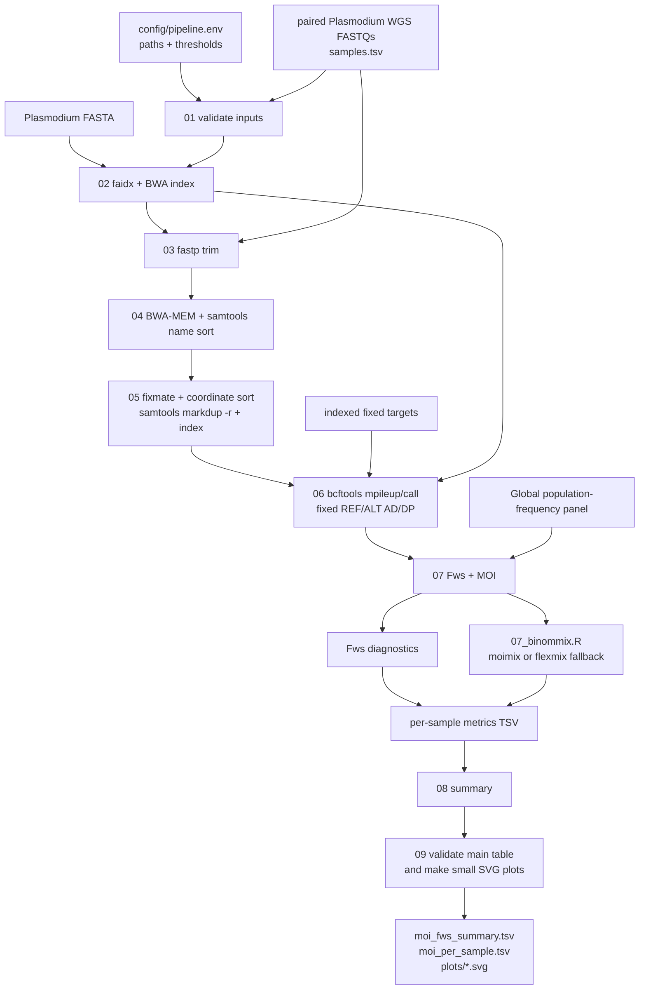

# Plasmodium WGS MOI/Fws pipeline

This repository contains a small, sequential pipeline for paired-end
*Plasmodium* WGS data. It trims reads, maps them to a parasite reference,
removes PCR duplicates, counts alleles at a frozen target panel, and reports
Fws plus a BinomMix MOI estimate for every sample. The final step validates the
human-readable main table and writes three small SVG quality/result plots.

## Applicability to Plasmodium WGS

Yes, for fixed-panel MOI/Fws analysis of short-read paired-end data, provided
that the reference FASTA, target file, and population-frequency panel describe
the same organism, contig names, and REF/ALT alleles. This workflow uses a
*P. falciparum* Pf3D7/Pf4 panel; that panel must not be reused
for another Plasmodium species or a different allele universe.

This is not a complete whole-genome variant-discovery workflow. It intentionally
stops at fixed-site allele counts, which is the input required by the MOI/Fws
calculation. Add a separately validated variant caller if ordinary VCF
discovery is also required. No FASTQ, BAM, reference, index, or result file is
stored in this repository.

## Quick start

Run these commands from this repository root:

```bash
./setup.sh --help
./setup.sh
conda activate moi_pipeline
./scripts/00_run_pipeline.sh --help
```

Then edit [`config/pipeline.env`](config/pipeline.env), create the sample sheet
described below, and run:

```bash
./scripts/00_run_pipeline.sh
```

After a completed run, the table check and plot generation can also be repeated
without rerunning previous steps:

```bash
./scripts/09_check_main_table_and_plots.py config/pipeline.env
```

`setup.sh` creates or updates the Conda environment `moi_pipeline`. The default
configuration assumes this small local layout (the data files themselves are
deliberately not included):

```text
data/
├── fastq/                                  # input FASTQ(.gz) files
└── reference/
    ├── GCF_000002765.6_genomic.fna         # Pf3D7 FASTA
    ├── pf4_global_maf001.targets.tsv.gz    # indexed target panel
    └── pf4_population_panel.tsv.gz         # target-aligned frequencies
```

Replace these paths in `config/pipeline.env` when resources are stored
elsewhere. `setup.sh` does not download biological data. If Conda, the solver,
an environment directory, an executable, or an R package is unavailable, it
prints the cause and a concrete fix. `setup.sh` cannot activate an environment
in the parent shell; run `conda activate moi_pipeline` afterwards.

## Input sample sheet

Create a tab-separated file named `samples.tsv` (or change `SAMPLES_TSV` in the
config):

```text
sample_id	R1	R2
sample_01	sample_01_R1.fastq.gz	sample_01_R2.fastq.gz
sample_02	/path/to/sample_02_R1.fastq.gz	/path/to/sample_02_R2.fastq.gz
```

Relative FASTQ paths are resolved under `RAW_DIR`; absolute paths are accepted.
Sample IDs may contain letters, numbers, `.`, `_`, and `-`.

## Configuration

All user-editable parameters are in [`config/pipeline.env`](config/pipeline.env).
Paths may be absolute or relative to the repository root.

The shipped defaults are conservative values for paired-end Illumina WGS and
the Pf3D7/Pf4 fixed-site analysis. They do not assume a particular cluster
scheduler, hidden filesystem mount, or pre-existing output directory.

| parameter | meaning |
|---|---|
| `SAMPLES_TSV` | three-column paired-read sheet (`sample_id`, `R1`, `R2`); default `samples.tsv` |
| `RAW_DIR` | base directory for relative FASTQ paths; default `data/fastq` |
| `REFERENCE` | parasite reference FASTA; default `data/reference/GCF_000002765.6_genomic.fna` for official *P. falciparum* 3D7 assembly `GCF_000002765.6`; a local `.fai` is created in the output directory |
| `TARGETS` | indexed frozen target file; default `data/reference/pf4_global_maf001.targets.tsv.gz`; supports four columns `chrom,pos,ref,alt` or three columns `chrom,pos,REF,ALT` where REF and ALT are comma-separated |
| `POPULATION_PANEL` | target-aligned frequency table with `chrom`, `pos`, `ref`, `alt`, and `Global`; default `data/reference/pf4_population_panel.tsv.gz` |
| `OUTPUT_DIR` | directory for all generated files; default `results` |
| `PLOTS_DIR` | directory for the small SVG plots; relative paths are below `OUTPUT_DIR`; default `plots` |
| `THREADS` | threads for trimming, mapping, and BAM processing; default `8` |
| `TRIM_QUALITY` | minimum base quality used by `fastp`; default `30` |
| `MIN_READ_LENGTH` | discard reads shorter than this after trimming; default `75` |
| `ADAPTER_R1`, `ADAPTER_R2` | optional explicit adapter sequences; default empty (fastp auto-detection) |
| `MIN_MAPQ` | mapping-quality filter used by `bcftools mpileup`; default `30` |
| `MIN_BASEQ` | base-quality filter used by `bcftools mpileup`; default `20` |
| `MAX_DEPTH` | per-file depth cap for `bcftools mpileup`; default `100000` |
| `POPULATION` | population column used for Fws; it must exist in `POPULATION_PANEL`; default `Global` |
| `FWS_MIN_DEPTH` | minimum modelled allele depth for Fws; default `50` |
| `MAX_UNMODELLED_FRACTION` | maximum fraction of reported depth not represented in REF/ALT; default `0.02` |
| `K_VALUES` | candidate MOI components; default `1,2,3,4,5` |
| `MOI_COVERAGE_THRESHOLD` | minimum depth for BinomMix sites; default `10` |
| `MOI_NITER` | maximum mixture-model iterations; default `1000` |
| `RESUME` | `1` reuses non-empty completed outputs; `0` recomputes them; default `1` |

## Ordered scripts

| step | script | program/action | important output |
|---:|---|---|---|
| 1 | `scripts/01_validate_inputs.sh` | checks Conda tools, sample sheet, FASTQs, reference, target index, panel, and `moimix`/`flexmix` | fail-fast preflight |
| 2 | `scripts/02_prepare_reference.sh` | creates an output-local FASTA symlink, `samtools faidx`, and `bwa index` | `reference/reference.fasta.fai` and BWA index |
| 3 | `scripts/03_trim_reads.sh` | `fastp` paired-end adapter detection, quality filtering, and minimum length | `trimmed/<sample>_R1/R2.fastq.gz` plus JSON/HTML QC |
| 4 | `scripts/04_align_wgs.sh` | `bwa mem` with a read group, piped to `samtools sort -n` | name-sorted BAM |
| 5 | `scripts/05_mark_duplicates.sh` | `samtools fixmate`, coordinate sort, `samtools markdup -r`, and index | duplicate-removed BAM and BAI |
| 6 | `scripts/06_extract_counts.sh` | `bcftools mpileup` (`MAPQ`, `baseQ`, depth limits) plus haploid allele-constrained `bcftools call` | six-column `chrom/pos/ref/alt/AD/DP` table |
| 7 | `scripts/07_estimate_moi_fws.py` + `scripts/07_binommix.R` | Fws from the population panel, then BinomMix over `K_VALUES` | per-sample MOI/Fws table |
| 8 | `scripts/08_summary.sh` | combines all rows and selects one human-readable line per sample | `moi_fws_summary.tsv` and `moi_per_sample.tsv` |
| 9 | `scripts/09_check_main_table_and_plots.py` | validates table headers, sample uniqueness, MOI/BIC fields, Fws values, and metric completeness; writes small dependency-free SVG plots | `OUTPUT_DIR/plots/moi_per_sample.svg`, `OUTPUT_DIR/plots/fws_per_sample.svg`, and `OUTPUT_DIR/plots/bic_support_per_sample.svg` |

The top-level `scripts/00_run_pipeline.sh` calls those steps sequentially. Full
command output is written to `OUTPUT_DIR/logs`; the terminal shows only step,
sample, and completion status. A failed command prints its last 40 log lines
and an explicit repair suggestion.

## MOI, Fws, and confidence fields

The exact MOI point is step 7. `07_estimate_moi_fws.py` calculates the two Fws
diagnostics, then calls `07_binommix.R`, which calls
`moimix::binommix(..., k=K_VALUES, niter=MOI_NITER)` when available. If `moimix`
cannot be built but `flexmix` is available, the script records the explicit
`moimix_unavailable_flexmix_equivalent` reason.

The per-sample table has one `binommix_moi` row with:

- `value`/`model_k`: selected MOI component count;
- `bic`: BIC of the selected model;
- `bic_delta`: difference between the best and second-best finite BIC (blank
  when only one candidate `K` was tested);
- `bic_weight`: relative BIC support among the tested models;
- `confidence`: `high` (weight ≥ 0.90), `moderate` (≥ 0.60), or `low`;
- `pi_hat` and `mu_hat`: fitted mixture proportions and allele-frequency means.

`bic_weight` and the resulting label are model-selection support, not a
calibrated confidence interval. The `moimix` interface used here does not
return a formal per-sample MOI confidence interval. The same table also has
`fws_moimix_compatible` and `fws_direct` rows.

The easy-to-read output is:

```text
results/moi_per_sample.tsv
sample_id  moi  moi_status  bic  bic_delta  bic_weight  confidence  fws
```

Step 9 checks this main table before creating the plots. It requires exactly one
row per sample, the three expected metric rows in the long table, safe and
unique sample IDs, integer MOI values of at least 1 when a model is estimated,
finite BIC values, BIC weights in `[0,1]`, and a confidence label consistent
with the BIC weight. A model-failure row is retained as an explicit
`abstain_model_failure` row rather than being silently dropped. Fws values are
required to be finite when present (values outside the usual `[0,1]` range are
reported as warnings). The check fails with a repair hint if the table is
missing, malformed, duplicated, or inconsistent with the long table.

The same step writes three small, text-based SVGs under `OUTPUT_DIR/plots` (or
the configured `PLOTS_DIR`): MOI per sample, Fws per sample, and relative
BinomMix BIC support per sample. They require no plotting package and are
intended for a quick terminal/browser check, not publication-quality figures.

The generated output layout is therefore:

```text
OUTPUT_DIR/
├── moi_fws_summary.tsv       # all three metric rows per sample
├── moi_per_sample.tsv        # one human-readable row per sample
└── plots/                    # three small SVGs from step 09
```

## References and resources

The following table records the biological resources required by this workflow.
None of these files is copied into this repository.

| resource | role in this pipeline | public accession or required filename | required at runtime? |
|---|---|---|---|
| paired WGS FASTQs | raw reads listed in `samples.tsv` | study-specific SRA/BioProject accession and R1/R2 filenames | yes |
| Pf3D7 reference FASTA | BWA alignment and `bcftools mpileup` | NCBI assembly [`GCF_000002765.6`](https://www.ncbi.nlm.nih.gov/datasets/genome/GCF_000002765.6/); filename `GCF_000002765.6_genomic.fna` | yes |
| frozen Pf4 target set | fixed sites passed to `mpileup` and MOI/Fws | `pf4_global_maf001.targets.tsv.gz` plus `.tbi`/`.csi` | yes |
| Pf4 population panel | allele frequencies for Fws | `pf4_population_panel.tsv.gz` | yes |
| known-sites VCF | optional BQSR branch, not used here | project-specific `3d7_hb3.gatk.final.vcf.gz` | no |

The Pf3D7 FASTA is the official *P. falciparum* 3D7 assembly identified by
accession `GCF_000002765.6`. The `pf4_global_maf001` target file and
`pf4_population_panel` are derived resources rather than generic references
with a safe substitute. Their chromosome names, positions, REF/ALT alleles,
and population column must match exactly. Obtain them from the project release
and do not silently substitute a different Pf4 release.

For a publication or data release, record the accession/release, download date,
file size, and a SHA-256 checksum for every external resource. A minimal
checksum record can be generated outside this repository with:

```bash
sha256sum GCF_000002765.6_genomic.fna \
  pf4_global_maf001.targets.tsv.gz pf4_population_panel.tsv.gz \
  > resource-sha256.txt
```

The public Pf3D7 FASTA can be acquired independently with the
[NCBI Datasets genome CLI](https://www.ncbi.nlm.nih.gov/datasets/docs/v2/reference-docs/command-line/datasets/download/genome/)
(write it to an external resource directory, not this repository):

```bash
mkdir -p /path/to/external_resources/pf3d7
datasets download genome accession GCF_000002765.6 --include genome \
  --filename /path/to/external_resources/pf3d7/pf3d7_GCF_000002765.6.zip
unzip -q /path/to/external_resources/pf3d7/pf3d7_GCF_000002765.6.zip \
  -d /path/to/external_resources/pf3d7
```

The extracted `*_genomic.fna` must be selected explicitly in `REFERENCE` after
checking its assembly accession and contig names. NCBI Datasets also records the accession
and package checksum; retain that metadata with the external resource. There
is no equivalent generic download command for the derived Pf4 targets and
population panel; obtain those files from a versioned project release.

### Software and method references

The Conda environment installs Python 3.11, R 4.3, `fastp`, BWA, SAMtools,
BCFtools/HTSlib, and `flexmix`; `setup_moimix.R` then attempts to install the
pinned `moimix` revision used by this workflow. Report the exact resolved
versions in a manuscript or supplement (for example,
`conda list --name moi_pipeline` and `Rscript -e 'sessionInfo()'`). The primary
method references are:

- Gardner MJ et al. Genome sequence of the human malaria parasite
  *Plasmodium falciparum*. *Nature* 2002;419:498–511. doi:
  [10.1038/nature01097](https://doi.org/10.1038/nature01097).
- Li H, Durbin R. Fast and accurate short read alignment with Burrows–Wheeler
  transform. *Bioinformatics* 2009;25:1754–1760. doi:
  [10.1093/bioinformatics/btp324](https://doi.org/10.1093/bioinformatics/btp324).
- Li H et al. The Sequence Alignment/Map format and SAMtools. *Bioinformatics*
  2009;25:2078–2079. doi:
  [10.1093/bioinformatics/btp352](https://doi.org/10.1093/bioinformatics/btp352).
- Danecek P et al. Twelve years of SAMtools and BCFtools. *GigaScience*
  2021;10:giab008. doi:
  [10.1093/gigascience/giab008](https://doi.org/10.1093/gigascience/giab008).
- Chen S et al. fastp: an ultra-fast all-in-one FASTQ preprocessor.
  *Bioinformatics* 2018;34:i884–i890. doi:
  [10.1093/bioinformatics/bty560](https://doi.org/10.1093/bioinformatics/bty560).
- Grün B, Leisch F. FlexMix version 2: finite mixtures with concomitant
  variables and a varying and constant parameter. *Journal of Statistical
  Software* 2008;28(4). doi:
  [10.18637/jss.v028.i04](https://doi.org/10.18637/jss.v028.i04).
- [`moimix`](https://github.com/bahlolab/moimix): Bahlolab GitHub repository, revision
  `802eaf1fab653690b1b1f1475c879b5189ee40ae`, installed by
  [`scripts/setup_moimix.R`](scripts/setup_moimix.R).

For a reproducible publication run, record the repository commit, the final
`config/pipeline.env`, the sample sheet, the resource checksum record, and the
resolved Conda/R version output together with the manuscript supplement. The
repository itself intentionally remains free of raw reads, reference genomes,
indexes, and generated result matrices.

## Reference and host-read policy

This workflow does not download or copy reference genomes. Before running,
provide the Pf3D7 FASTA at `REFERENCE`; step 02 creates only a symlink under
`OUTPUT_DIR/reference/` and builds the FASTA/BWA indexes there. The target and
population files must be the matching frozen pair listed above. Do not replace
the Pf3D7 FASTA with a different assembly without rebuilding and validating
the target/panel coordinates and REF/ALT alleles.

This path has no human-reference mapping or host-read removal: reads go directly
through trimming, Pf3D7 alignment, duplicate removal, and fixed-site counting.
Human depletion is useful when the material contains
substantial host DNA or when privacy requires removal before sharing, but it is
not an automatic requirement for cultured/enriched parasite WGS. If host
contamination is expected, add and validate a separate pre-alignment step that
uses a human reference (for example, GRCh38) and preserves paired unmapped
reads; that reference and its indexes must also remain external. It is not
implemented here because its inclusion would change the workflow and require a
project-specific host-depletion policy.

## Suitability limits

- Use a reference and target/panel set for the same Plasmodium species and
  assembly. The included Pf4 panel is *P. falciparum*-specific.
- Mixed infections are represented through allele counts; the `--ploidy 1`
  constrained call is an allele-count extraction convention, not a claim that
  a mixed sample is biologically haploid.
- The runner removes duplicates and applies MAPQ/baseQ filters, but it does
  not perform contamination estimation, coverage-based sample exclusion, or
  whole-genome variant filtering. Review the QC files before interpretation.

## Mermaid workflow


